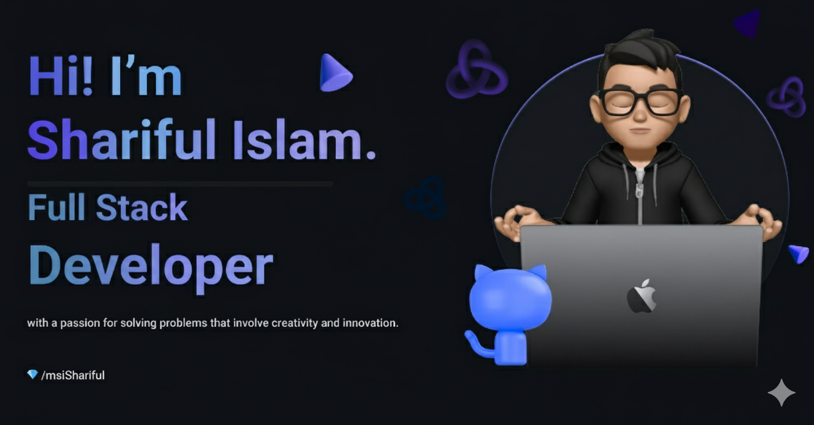
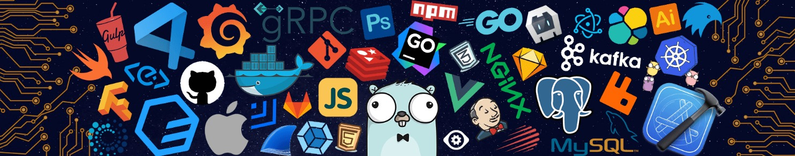

<!-- ╔═══════════════════════════════════════════════════════════╗
     ║                    HEADER                                 ║
     ╚═══════════════════════════════════════════════════════════╝ -->

<h1>
  Hi, I'm Shariful Islam&nbsp;
</h1>

  

<!-- Social buttons -->
&nbsp;
&nbsp;

  

<!-- Live counters -->
&nbsp;
&nbsp;

<!-- ╔═══════════════════════════════════════════════════════════╗
     ║                    ABOUT ME                               ║
     ╚═══════════════════════════════════════════════════════════╝ -->

## 🧑‍💻 About Me

  
  
  

I build the **invisible machinery that powers great products** — the APIs, services, and pipelines users never see but always rely on.

- 🔭 Designing **reliable, high-performance backend systems** — clean REST APIs to event-driven microservices
- ⚙️ Daily drivers: **Laravel** `PHP` &nbsp;·&nbsp; **Spring Boot** `Java` &nbsp;·&nbsp; **Express.js** `Node.js`
- 🗄️ Obsessive about **database design, query optimization & caching**
- 🚀 Shipping with **Docker · Kubernetes · Jenkins · Terraform**
- 📚 Currently exploring **distributed systems & cloud-native architecture**
- 🎓 BSc in Computer Science & Engineering — **AIUB**
- ✈️ Off the keyboard: **travelling 🏕️**

 

<!-- ╔═══════════════════════════════════════════════════════════╗
     ║                    TECH STACK                             ║
     ╚═══════════════════════════════════════════════════════════╝ -->

## 🛠️ Tech Stack

### ⚙️ Backend & Frameworks

  
  
  
  
  

### 💻 Languages

  
  
  
  
  
  

### 🗄️ Databases & Caching

  
  
  
  
  

### ☁️ DevOps & Infrastructure

  
  
  
  
  
  
  
  

### 🧰 Tools & Testing

  
  
  
  
  
  

<!-- ╔═══════════════════════════════════════════════════════════╗
     ║                    NPM PACKAGES                           ║
     ╚═══════════════════════════════════════════════════════════╝ -->

## 📦 NPM Packages

  <i>Open-source tooling I build & maintain — </i>
  

<table align="center" width="100%">
  <tr>
    <td align="center" width="50%">
      <h3>
        <a href="https://www.npmjs.com/package/@msishariful/contextkit" target="_blank">⚡ contextkit</a>
      </h3>
      
Token-efficient AI coding agent configuration — generates optimized <code>CLAUDE.md</code> & agent config files.

      

        
        
      

      <code>npm i @msishariful/contextkit</code>
    </td>
    <td align="center" width="50%">
      <h3>
        <a href="https://www.npmjs.com/package/@msishariful/claude-usage-cli" target="_blank">📟 claude-usage-cli</a>
      </h3>
      
View your Claude Code token usage & costs right from the terminal — fast, zero-config CLI.

      

        
        
      

      <code>npm i -g @msishariful/claude-usage-cli</code>
    </td>
  </tr>
</table>

<!-- ╔═══════════════════════════════════════════════════════════╗
     ║               HIGHLIGHTED OPEN SOURCE                     ║
     ╚═══════════════════════════════════════════════════════════╝ -->

## 🌟 Highlighted Open Source

  <i>Hand-picked projects I've built and shared with the community 💙</i>

<table align="center" width="100%">
  <tr>
    <td align="center" width="50%" valign="top">
       
      <h3>🧠 <a href="https://github.com/msiShariful/claude-token-inspector">claude-token-inspector</a></h3>
      

        
        
      

      
Claude Code plugin with <b>8 skills</b> to inspect, audit & optimize your context window — see exactly where your tokens go. 🔍

      

        
        
        
      

       
    </td>
    <td align="center" width="50%" valign="top">
       
      <h3>🏛️ <a href="https://github.com/msiShariful/meridian-erp">meridian-erp</a></h3>
      

        
        
      

      
Modular open-source <b>ERP</b> built on Spring Modulith — clean domain boundaries, server-rendered UI, enterprise-grade architecture. 🏗️

      

        
        
        
        
      

       
    </td>
  </tr>
  <tr>
    <td align="center" width="50%" valign="top">
       
      <h3>💰 <a href="https://github.com/msiShariful/fintracker">fintracker</a></h3>
      

        
        
      

      
Personal <b>finance tracker</b> — expenses, budgets & insights with a secure, server-rendered UI on Java 21. 📊

      

        
        
        
        
      

       
    </td>
    <td align="center" width="50%" valign="top">
       
      <h3>🦀 <a href="https://github.com/msiShariful/rustty">rustty</a></h3>
      

        
        
      

      
Lightweight <b>GPU-rendered terminal emulator</b> with full ANSI support — built for speed, from scratch. ⚡

      

        
        
        
      

       
    </td>
  </tr>
</table>

<h3 align="center">🐳 DevOps & Infrastructure</h3>

<table align="center" width="100%">
  <tr>
    <td align="center" width="33%" valign="top">
       
      <h4>📨 <a href="https://github.com/msiShariful/kafka-docker-compose">kafka-docker-compose</a></h4>
      

        
      

      
Spin up an <b>Apache Kafka</b> stack with a single command — ready-made Docker Compose setup.

      

        
        
      

       
    </td>
    <td align="center" width="33%" valign="top">
       
      <h4>🤖 <a href="https://github.com/msiShariful/jenkins-docker-compose">jenkins-docker-compose</a></h4>
      

        
      

      
<b>Jenkins CI/CD</b> server in containers — one-command bootstrap for your build pipeline.

      

        
        
      

       
    </td>
    <td align="center" width="33%" valign="top">
       
      <h4>🐧 <a href="https://github.com/msiShariful/LAMP-Installation-Script">LAMP-Installation-Script</a></h4>
      

        
      

      
Shell script that automates a full <b>LAMP stack</b> setup on any Linux server.

      

        
        
        
        
      

       
    </td>
  </tr>
</table>

  

<!-- ╔═══════════════════════════════════════════════════════════╗
     ║                    GITHUB STATS                           ║
     ╚═══════════════════════════════════════════════════════════╝ -->

## 📊 GitHub Stats

  

  

  

<!-- ╔═══════════════════════════════════════════════════════════╗
     ║                 EDUCATION & CERTIFICATES                  ║
     ╚═══════════════════════════════════════════════════════════╝ -->

## 🎓 Education & Certifications

<table align="center" width="100%">
  <tr>
    <td align="center" width="42%" valign="middle">
      <h3>🎓 Education</h3>
      
      <h4>BSc in Computer Science & Engineering</h4>
      
American International University–Bangladesh (AIUB)

    </td>
    <td align="center" width="58%" valign="middle">
      <h3>📜 Certifications</h3>
      

        
          
        
          
        
          
        
          
        
          
        
      

      

        
      

    </td>
  </tr>
</table>

<!-- ╔═══════════════════════════════════════════════════════════╗
     ║                  BEYOND THE CODE                          ║
     ╚═══════════════════════════════════════════════════════════╝ -->

## ✨ Beyond the Code

<table border="0">
  <tr>
    <td align="center" width="50%">
      
       🌆 <i>where ideas stay up late</i>
    </td>
    <td align="center" width="50%">
      
       ⌨️ <i>in my natural habitat</i>
    </td>
  </tr>
</table>

 

  

<samp>⏳ &nbsp;You have stayed on my profile for ◔_◔&nbsp; ⌛</samp>

  

&nbsp;&nbsp;

<i>The face is the front-end. The gears are the back-end. I take care of the gears.</i> ⚙️

  

<!-- ╔═══════════════════════════════════════════════════════════╗
     ║                    CONNECT                                ║
     ╚═══════════════════════════════════════════════════════════╝ -->

## 🤝 Let's Connect

> *"First, solve the problem. Then, write the code."* — John Johnson

  I'm always open to discussing <b>backend architecture, open-source collaboration, or new opportunities</b>. 
  The fastest way to reach me 👇

  
  

  

  

  

